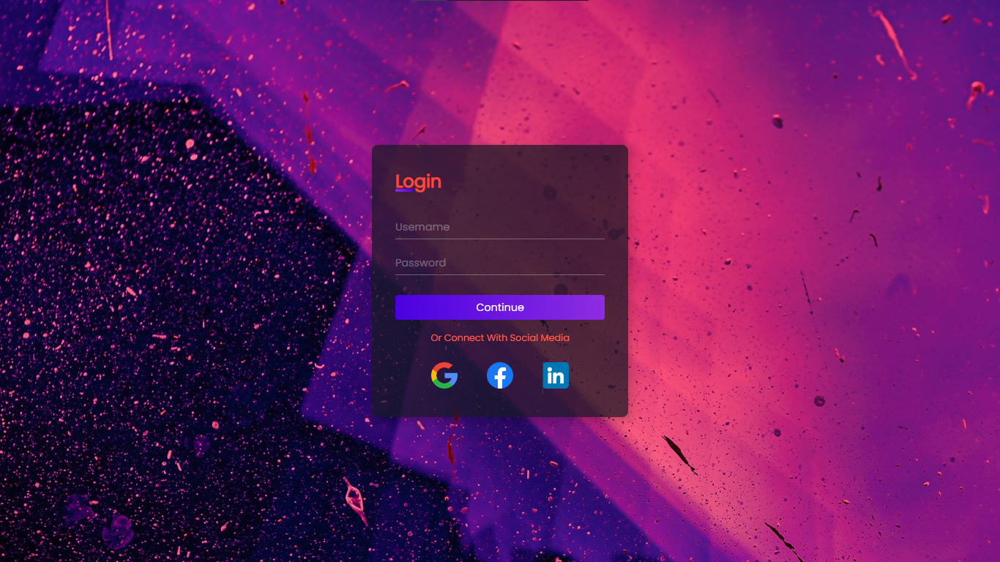
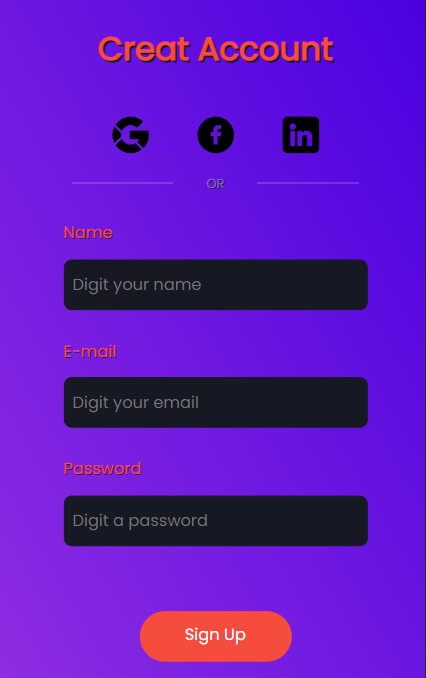

<h1 align="center">Login and Sign-Up</h1>
 

    
       
    

  

## Responsive Mobile:
 

    
      
    

  

## About:

The project are pages of Login and Sign-Up what has objectiv to improve the hard skills.

 

## 🛠 Tecnologies:

The following tools were used in the construction of the project:

 <ul>
    <li>Html5</li>
    <li>Css3</li>
 </ul>
